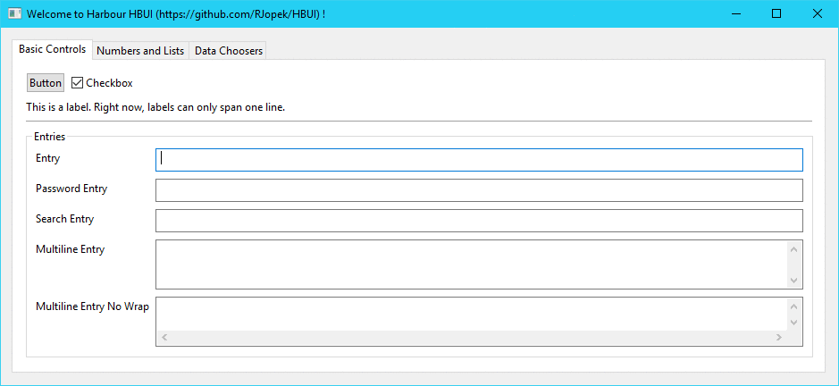
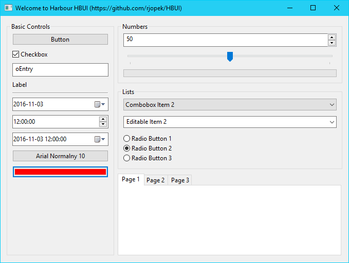
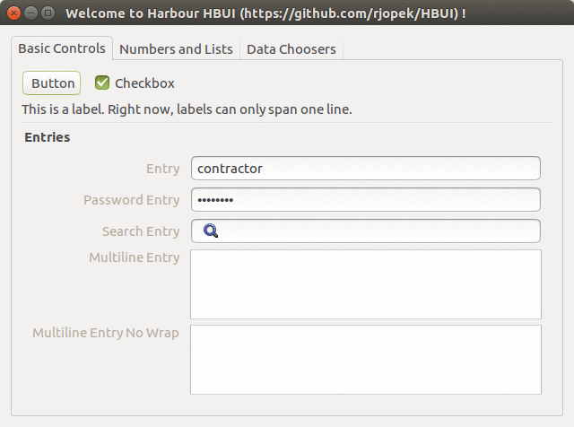
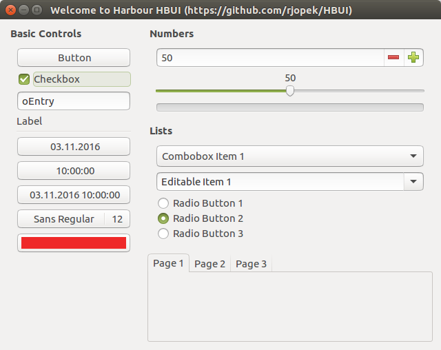
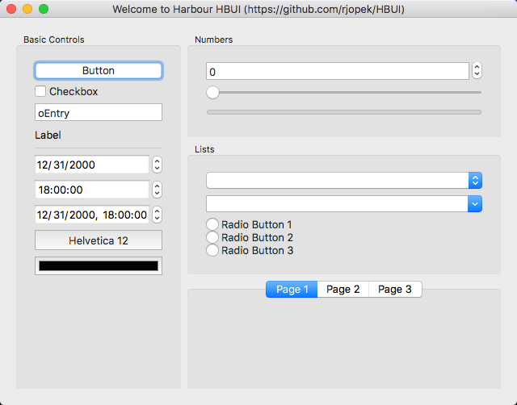
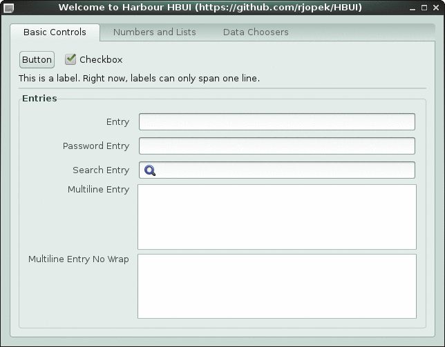
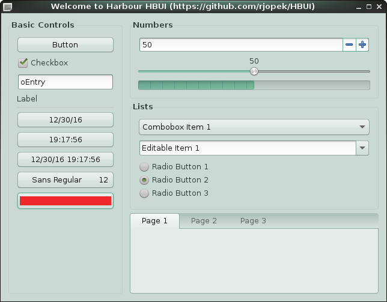

# [**hbui**](https://harbour.pl/hbui)

Graphical user interface library for the Harbour compiler, this is a wrapper library around [**libui**](https://github.com/andlabs/libui), a portable GUI library.

* Read more about the - [Cross platform](https://en.wikipedia.org/wiki/Cross-platform)
* Read more about the - [Harbour (software)](https://en.wikipedia.org/wiki/Harbour_(software))

### How to begin

* First of all download:

   * [**Harbour 3.2**](https://github.com/harbour/core)
   * [**libui**](https://github.com/andlabs/libui)
   * [**hbui**](https://github.com/rjopek/hbui/archive/master.zip)

### Documentation

* [ **Home page** ](http://harbour.pl/hbui/)
* [ **Step by step compilation**](docs/tutorial/tutorial.md)

### Sample source code

``` harbour
FUNCTION Main()

   LOCAL oWindow

   oWindow := uiNewWindow( "Main Window", 800, 600, .T. )

   uiControlShow( oWindow )

   uiMain()
   uiUninit()

RETURN NIL
```

### Screenshots
















---

