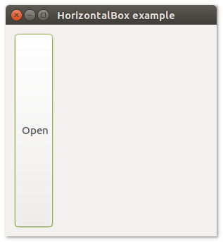
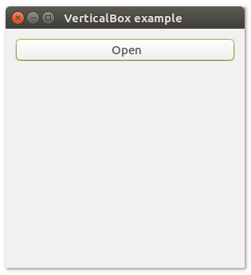

# uiBox

#### Description

uiBox is a Control that holds a group of Controls horizontally or vertically. If horizontally, then all controls have the same height. If vertically, then all controls have the same width.
By default, each control has its preferred width (horizontal) or height (vertical); if a control is marked "stretchy", it will take whatever space is left over. If multiple controls are marked
stretchy, they will be given equal shares of the leftover space. There can also be space between each control ("padding").

#### Functions

> * uiBoxAppend( `pBox` , `pControl` , `lStretchy` )
> * uiBoxDelete( `pBox` , `nIndex` )
> * uiBoxPadded( `pBox` )
> * uiBoxSetPadded( `pBox` , `lPadded` )
> * uiNewHorizontalBox()
> * uiNewVerticalBox()

### uiBoxAppend( pBox, pControl, lStretchy )

#### Arguments

* `pBox` parameter control uiNewHorizontalBox() or uiNewVerticalBox()
* `pControl` parameter child control to append.
* `lStretchy` is a logical value that specifies full stretchy `.T.` or `.F.` If lStretchy is set to true, the control will be expanded to fill all available space.

#### Returns

uiBoxAppend() has no return value.

#### Description

Appends a child to the box.

#### Example

``` c

pButton := uiNewButton( "Open" )
uiBoxAppend( pHorizontalBox, pButton, .T. )

```

### uiBoxDelete( pBox, nIndex )

#### Arguments

* `pBox` parameter control uiNewHorizontalBox() or uiNewVerticalBox()
* `nIndex` parameter Index

#### Returns

uiBoxDelete() has no return value.

#### Description

Deletes a child from a box.

#### Example

``` c

```

### uiBoxPadded( pBox )

#### Arguments

* `pBox` parameter control uiNewHorizontalBox() or uiNewVerticalBox()

#### Returns

uiBoxPadded() a logical return value `.T.` or `.F.` 

#### Description

Returns whether the box is padded.

#### Example

``` c

lBoxPadded := uiBoxPadded( pHorizontalBox )

```

``` c

IF uiBoxPadded( pHorizontalBox )

   ...

ELSE

   ...

ENDIF

```

### uiBoxSetPadded( pBox, lPadded )

#### Arguments

* `pBox` parameter control uiNewHorizontalBox() or uiNewVerticalBox()
* `lPadded` is a logical value that specifies space between controls `.T.` or `.F.` 

#### Returns

uiBoxSetPadded() has no return value.

#### Description

uiBoxSetPadded controls whether there is space between each control of the Box. The size of the padding is determined by the OS and its best practices.

#### Example

``` c

uiBoxSetPadded( pHorizontalBox, .T. )

```

### uiNewHorizontalBox()

#### Returns

uiNewHorizontalBox() returns pointer.

#### Description

uiNewHorizontalBox() creates a new empty horizontal Box.

#### Example

``` c

pHorizontalBox := uiNewHorizontalBox()

```

### uiNewVerticalBox()

#### Returns

NewVerticalBox() returns pointer.

#### Description

NewVerticalBox() creates a new empty vertical box.

#### Example

``` c

pVerticalBox := uiNewVerticalBox()

```

#### Sample source code

``` c

#include "hbui.ch"

PROCEDURE Main()

   LOCAL error
   LOCAL pWindow
   LOCAL pButton
   LOCAL pHorizontalBox

   IF ! HB_ISNULL( error := uiInit() )
      Alert( "Failed to initialize libui... " + error )
      RETURN
   ENDIF

   pWindow := uiNewWindow( "HorizontalBox example", 300, 300, .T. )
   uiWindowOnClosing( pWindow, @onWindowClosing(), NIL )
   uiWindowSetMargined( pWindow, .T. )

   pButton := uiNewButton( "Open" )

   pHorizontalBox := uiNewHorizontalBox()
   uiBoxSetPadded( pHorizontalBox, .T. )
   uiBoxAppend( pHorizontalBox, pButton, .F. )

   uiWindowSetChild( pWindow, pHorizontalBox )
   uiControlShow( pWindow )

   uiMain()
   uiUninit()

   RETURN

FUNCTION onWindowClosing( pWindow, DATA )

   HB_SYMBOL_UNUSED( pWindow )
   HB_SYMBOL_UNUSED( DATA )

	uiQuit()

   RETURN .T.

```

##### Output



#### Sample source code

``` c

#include "hbui.ch"

PROCEDURE Main()

   LOCAL error
   LOCAL pWindow
   LOCAL pButton
   LOCAL pVerticalBox

   IF ! HB_ISNULL( error :=  uiInit() )
      Alert( "Failed to initialize libui... " + error )
      RETURN
   ENDIF

   pWindow := uiNewWindow( "VerticalBox example", 300, 300, .T. )
   uiWindowOnClosing( pWindow, @onWindowClosing(), NIL )
   uiWindowSetMargined( pWindow, .T. )

   pButton := uiNewButton( "Open" )

   pVerticalBox := uiNewVerticalBox()
   uiBoxSetPadded( pVerticalBox, .T. )
   uiBoxAppend( pVerticalBox, pButton, .F. )

   uiWindowSetChild( pWindow, pVerticalBox )
   uiControlShow( pWindow )

   uiMain()
   uiUninit()

   RETURN

FUNCTION onWindowClosing( pWindow, DATA )

   HB_SYMBOL_UNUSED( pWindow )
   HB_SYMBOL_UNUSED( DATA )

	uiQuit()

   RETURN .T.

```

##### Output:



---

