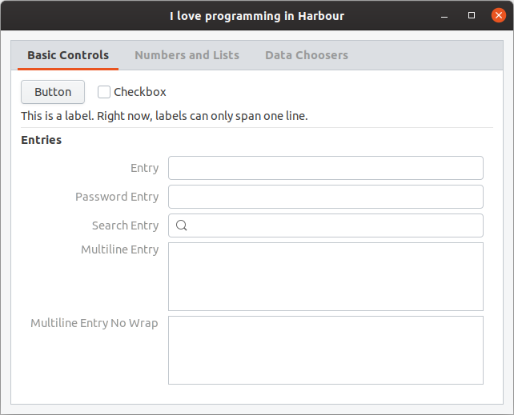

## Download binary for libui and hbui

* MSVC

``` 
c:\>

c:\>git clone https://github.com/rjopek/libui

c:\>git clone https://github.com/rjopek/hbui

c:\>set PATH=%PATH%;c:\libui\build\meson-out\

c:\>cd c:\hbui\samples

c:\hbui\samples>hbmk2 01.prg -run

```

And that's all.

---

## Runtime Requirements

* Windows: Windows Vista SP2 with Platform Update or newer
* Unix: GTK+ 3.10 or newer
* Mac OS X: OS X 10.8 or newer

## Build Requirements

* All platforms:

   * [Meson](https://mesonbuild.com/) 0.48.0 or newer
   * Any of Meson's backends; this section assumes you are using [Ninja](https://ninja-build.org/), but there is no reason the other backends shouldn't work.

# 

* Windows: either

   * Microsoft Visual Studio 2013 or newer (2013 is needed for va_copy()) — you can build either a static or a shared library
   * MinGW-w64 (other flavors of MinGW may not work) — you can only build a static library; shared library support will be re-added once the following features ome in:

      * [Isolation awareness](https://msdn.microsoft.com/en-us/library/aa375197%28v=vs.85%29.aspx), which is how you get themed controls from a DLL without needing a manifest

* Unix: nothing else specific
* Mac OS X: nothing else specific, so long as you can build Cocoa programs

## Compilation libui in Windows MSVC

libui uses only [the standard Meson build options](https://mesonbuild.com/Builtin-options.html), so a libui build can be set up just like any other:

* [Download Meson](https://github.com/mesonbuild/meson/releases)

``` batchfile

c:\>git clone https://github.com/andlabs/libui

c:\>cd libui

c:\libui>meson setup build # --default-library=[ shared | static ]

c:\libui>ninja -C build

```

## Compilation **hbui** in Windows MSVC

``` batchfile

c:\>git clone https://github.com/rjopek/hbui

c:\>set HB_WITH_LIBUI=c:\libui

c:\>cd hbui

c:\hbui>hbmk2 hbui.hbp

c:\hbui>cd samples

c:\hbui\samples>hbmk2 01.prg -run
```

##### Output:


## Compilation libui in Linux

``` batchfile

$ sudo apt install python3-pip libgtk-3-dev ninja-build
$ sudo -H pip3 install meson
$ git clone https://github.com/andlabs/libui
$ cd libui
$ meson setup build # --default-library=[ shared | static ]
$ ninja -C build

$ sudo ninja -C build install

```

* `--default-library=[ shared | static ]` controls whether libui is built as a shared library or a static library the default is shared.

## Compilation hbui in Linux

``` batchfile

$ git clone https://github.com/rjopek/hbui
$ export HB_WITH_LIBUI="$HOME/libui"
$ export PATH=$HOME/libui/build/meson-out:$PATH
$ cd hbui
$ hbmk2 hbui.hbp
$ cd samples
$ hbmk2 01.prg -run

```

##### Output:



